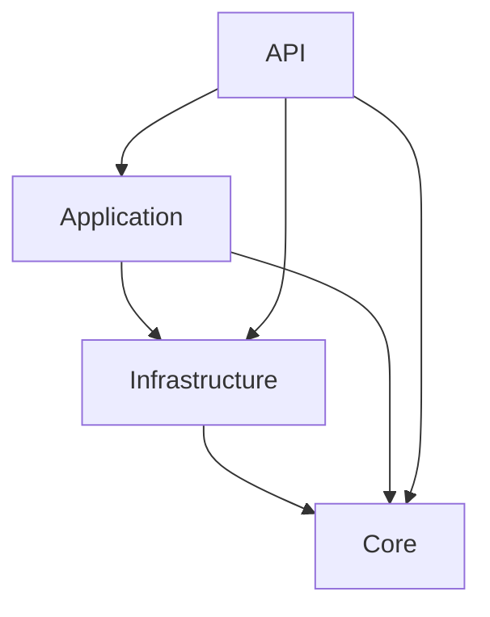

# Architectural documentation

This project is heavily Inspired by Clean Architecture.

The project is structured in four layers:
- `API`: This layer is responsible for handling user interactions and delivering data to the user interface.
- `Application`: This layer contains the business logic and use cases of the application. It acts as an intermediary between the `API` layer and the `Core` layer. This layer is independent of any specific UI or infrastructure concerns.
- `Core`: This layer represents the application’s core, encapsulating business rules, entities, and domain-specific logic.
- `Infrastructure`: This layer deals with external concerns such as databases and external services. It contains implementations of interfaces defined in the `Application` layer and interacts with external resources.

There is a dependency between the layers which works as follows



where each arrow denotes an allowed dependency.

In other words, the domain of the application represented by the layer `Core` has no access to any of the other layers. The `Infrastructure` layer can only access the `Core` layer. The `Application` layer has access to the `Infrastructure` and `Core` layer and the `API` layer has access to all other layer.

## Core

The domain of the application contains the relevant domain entities, as `Content`, `Tag`, `User` and `Profile`.

Identifiers of domain entities are not included in the entities themselves and are instead managed using an `Id` data type, which has a phantom type used to specify which entity it is actually identifying.

The domain layer contains also the [repositories](https://www.martinfowler.com/eaaCatalog/repository.html), defined as records of functions, to interact with collections of domain objects. Those records are parameterized by a monadic context `m` in order to define the interface of repositories without committing to a particular implementation.

### A concrete example

For example, to interact with `User`s, we have a `UserRepository` which abstracts the operations concerning users

```haskell
data UserRepository m = UserRepository
  { findByName         :: Text -> m (Id User, User)
  -- ^ Searches the repository for 'User's with the provided name
  , findById           :: Id User -> m (Id User, User)
  -- ^ Searches the repository for a 'User' with the provided 'Id'
  , add                :: Text -> EncryptedPassword -> m (Id User)
  -- ^ Adds a user with the provided name and password
  , deleteUserById     :: Id User -> m NoContent
  -- ^ Deletes a user with the provided 'Id'
  , updatePasswordById :: Id User -> EncryptedPassword -> m NoContent
  -- ^ Updates the password of a user with the provided 'Id'
  , updateUsernameById :: Id User -> Text -> m NoContent
  -- ^ Updates the username of a user with the provided 'Id'
  , getProfileById     :: Id User -> m Profile
  -- ^ Retrieves the profile of a user with the provided 'Id'
  , createProfileById  :: Id User -> Profile -> m NoContent
  -- ^ Creates a profile for a user with the provided 'Id'
  , updateProfileById  :: Id User -> Profile -> m NoContent
  -- ^ Updates the profile of a user with the provided 'Id'
  }
```

These operations define an interface which allows us to interact with an abstract model of a collection of `User`s.
In practice, if we wanted to combine these operation, we would need to impose restrictions on the context `m` in exchange for a more powerful api. For example, to allow sequential composition of such operations, we would need to restrict `m` to be a `Monad`. Similarly, if we wanted to grant to these operations the possiblity of failure, we could add a `MonadError` contraint. Broadly speaking, we could use `mtl`-style typeclasses to restrict the allowed contexts in exchange for more computational expressivity.

## Infrastructure

The infrastructure layer provides the implementations needed by the application. Specifically it provides access to the database, to error logging and user authentication.

### Configuration

We define the schema of the required configuration and a bidirectional codec.

### Database

Contains the implementation, based on `PostgreSQL`, of the repositories defined in the domain layer.

In the concrete implementations we specialize the context `m` of the repositories to `ExceptT e IO` so that we can work in a concrete monad.

The repositories are combining the queries defined at the database level and are using the serialization/unserialization mechanism to convert between the domain entities and their representation at the database level.

### Logging

Provides to the application the ability of logging error messages.

### Authentication

It contains two services, `PasswordManager` and `AuthenticateUser`, where the latter is using the former.

Being infrastructural services their interface and implementation are defined together in the same module.

## API

The API layer deals mainly with two issues:
- setting up all the services required by the application
- describing and implementing the API of the application

### Services

The `AppServices` modules deals with building all the required services and packing them all together.

To achieve this we first need to choose an explicit implementation for each service.

At this level we want all the services to work directly in the `Handler` monad. This requires us to hoist the services from the concrete context where they are initially defined to `Handler`.

Doing so implies that we also need to handle the errors generated by the services. Hence at this point we decide how to log the error messages and which status code is appropriate for every specific error.

#### A concrete example

Considering our recurring example with `UserRepository`, at the domain level we're using a generic monadic context `m`, while at the infrastructure level we specialized it to `ExceptT UserRepositoryError IO`.

Now, at the application level, we're working in the `Handler` context, because that is where `Servant` handlers operate. To fill the gap and connect all the pieces, we hoist the `ExceptT UserRepositoryError IO` context into the `Handler` one, using a natural transformation `forall a. ExceptT UserRepositoryError IO a -> Handler a`.

```haskell
postgresUserRepository :: UserRepository (ExceptT UserRepositoryError IO)

hoistUserRepository :: (forall a. m a -> n a) -> UserRepository m -> UserRepository n

eitherTToHandler :: forall a. ExceptT UserRepositoryError IO a -> Handler a

handlerUserRepository :: UserRepository Handler
handlerUserRepository = hoistUserRepository eitherTToHandler postgresUserRepository
```

### API endpoints

Once we setup all the required services, we can pass them to the API endpoints which are defined in the `Application` module.

We make use of Servant `NamedRoutes` to define our API is a clear and composable way, splitting their respective handlers in several modules.